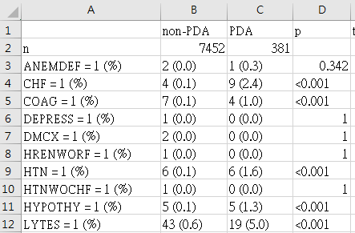

<!-- rnb-text-begin -->

---
title: "dxpr"
output: html_notebook
subtitle: "an R package for generating analysis-ready data from electronic health records - diagnoses and procedures"
author: "Yi-Ju Tseng, PhD @ DHLab NYCU"
date: 2023-05-12
---

## Features

-   **Data integration**
    -   Transform codes into uniform format and group code into categories.
-   **Data Wrangling**
    -   Generate statistical information and transform data into analysis-ready format.
-   **Visualization**
    -   Provide overviews for the diagnosis data.

## Overview


## Installation


<!-- rnb-text-end -->


<!-- rnb-chunk-begin -->


<!-- rnb-source-begin eyJkYXRhIjoiYGBgclxuaW5zdGFsbC5wYWNrYWdlcyhcInJlbW90ZXNcIilcbnJlbW90ZXM6Omluc3RhbGxfZ2l0aHViKFwiREhMYWItVFNFTkcvZHhwclwiKVxuYGBgIn0= -->

```r
install.packages("remotes")
remotes::install_github("DHLab-TSENG/dxpr")
```

<!-- rnb-source-end -->

<!-- rnb-chunk-end -->


<!-- rnb-text-begin -->


## Load packages


<!-- rnb-text-end -->


<!-- rnb-chunk-begin -->


<!-- rnb-source-begin eyJkYXRhIjoiYGBgclxubGlicmFyeShkeHByKVxuYGBgIn0= -->

```r
library(dxpr)
```

<!-- rnb-source-end -->

<!-- rnb-output-begin eyJkYXRhIjoiUmVnaXN0ZXJlZCBTMyBtZXRob2Qgb3ZlcndyaXR0ZW4gYnkgJ2RhdGEudGFibGUnOlxuICBtZXRob2QgICAgICAgICAgIGZyb21cbiAgcHJpbnQuZGF0YS50YWJsZSAgICAgXG4ifQ== -->

```
Registered S3 method overwritten by 'data.table':
  method           from
  print.data.table     
```


<!-- rnb-output-end -->

<!-- rnb-source-begin eyJkYXRhIjoiYGBgclxubGlicmFyeSh0aWR5dmVyc2UpXG5gYGAifQ== -->

```r
library(tidyverse)
```

<!-- rnb-source-end -->

<!-- rnb-output-begin eyJkYXRhIjoiUmVnaXN0ZXJlZCBTMyBtZXRob2RzIG92ZXJ3cml0dGVuIGJ5ICdkYnBseXInOlxuICBtZXRob2QgICAgICAgICBmcm9tXG4gIHByaW50LnRibF9sYXp5ICAgICBcbiAgcHJpbnQudGJsX3NxbCAgICAgIFxu4pSA4pSAIEF0dGFjaGluZyBwYWNrYWdlcyDilIDilIDilIDilIDilIDilIDilIDilIDilIDilIDilIDilIDilIDilIDilIDilIDilIDilIDilIDilIDilIDilIDilIDilIDilIDilIDilIDilIDilIDilIDilIDilIDilIDilIDilIDilIDilIDilIDilIDilIDilIDilIDilIDilIDilIDilIDilIDilIAgdGlkeXZlcnNlIDEuMy4xIOKUgOKUgFxu4pyUIGdncGxvdDIgMy4zLjYgICAgIOKclCBwdXJyciAgIDAuMy40XG7inJQgdGliYmxlICAzLjIuMSAgICAg4pyUIGRwbHlyICAgMS4xLjFcbuKclCB0aWR5ciAgIDEuMi4wICAgICDinJQgc3RyaW5nciAxLjQuMFxu4pyUIHJlYWRyICAgMi4xLjIgICAgIOKclCBmb3JjYXRzIDAuNS4xXG7ilIDilIAgQ29uZmxpY3RzIOKUgOKUgOKUgOKUgOKUgOKUgOKUgOKUgOKUgOKUgOKUgOKUgOKUgOKUgOKUgOKUgOKUgOKUgOKUgOKUgOKUgOKUgOKUgOKUgOKUgOKUgOKUgOKUgOKUgOKUgOKUgOKUgOKUgOKUgOKUgOKUgOKUgOKUgOKUgOKUgOKUgOKUgOKUgOKUgOKUgOKUgOKUgOKUgOKUgOKUgOKUgCB0aWR5dmVyc2VfY29uZmxpY3RzKCkg4pSA4pSAXG7inJYgZHBseXI6OmZpbHRlcigpIG1hc2tzIHN0YXRzOjpmaWx0ZXIoKVxu4pyWIGRwbHlyOjpsYWcoKSAgICBtYXNrcyBzdGF0czo6bGFnKClcbiJ9 -->

```
Registered S3 methods overwritten by 'dbplyr':
  method         from
  print.tbl_lazy     
  print.tbl_sql      
── Attaching packages ──────────────────────────────────────────────── tidyverse 1.3.1 ──
✔ ggplot2 3.3.6     ✔ purrr   0.3.4
✔ tibble  3.2.1     ✔ dplyr   1.1.1
✔ tidyr   1.2.0     ✔ stringr 1.4.0
✔ readr   2.1.2     ✔ forcats 0.5.1
── Conflicts ─────────────────────────────────────────────────── tidyverse_conflicts() ──
✖ dplyr::filter() masks stats::filter()
✖ dplyr::lag()    masks stats::lag()
```


<!-- rnb-output-end -->

<!-- rnb-chunk-end -->


<!-- rnb-text-begin -->


# Learn from a real analysis case!

## Research question

-   Newborns who were diagnosed with patent ductus arteriosus (PDA) vs. without PDA

    -   Define **PDA** and **non-PDA** groups

-   The differences of comorbidity between these two groups

    -   Define comorbidity

# Data - MIMIC III

## Example data - from MIMIC III (1/2)

-   A large, **freely-available** database
-   Deidentified health-related data, over **40,000** patients
-   ICU of the Beth Israel Deaconess Medical Center, 2001-2012.
-   You must completing **CITI Data or Specimens Only Research** training
-   [MIMIC III](https://physionet.org/content/mimiciii/1.4/)

## Example data - from MIMIC III (2/2)

-   Demographics
-   Vital sign measurements made at the bedside
    -   \~1 data point/hr
-   Laboratory test results
-   Procedures
-   Medications
-   Caregiver notes, imaging reports
-   Mortality (including post-hospital discharge)

## Example data - newborn's data

-   **Admission**: ADMISSIONS
    -   Unique hospitalization for each patient in the database `HADM_ID`
    -   Use to get a `SUBJECT_ID` list of **newborn**
-   **Diagnosis**: DIAGNOSES_ICD
    -   Coded using the **I**nternational Statistical **C**lassification of **D**iseases and Related Health Problems ('ICD') system
    -   Use to analyze comorbidity

## Take a look of the example data

From **DIAGNOSES_ICD** data, only for newborn


<!-- rnb-text-end -->


<!-- rnb-chunk-begin -->


<!-- rnb-source-begin eyJkYXRhIjoiYGBgclxuIFxuc2FtcGxlTmV3Ym9ybjwtcmVhZFJEUyhcImRhdGEvc2FtcGxlTmV3Ym9ybi5yZHNcIilcbmdsaW1wc2Uoc2FtcGxlTmV3Ym9ybiwgd2lkdGggPSA3MClcbmBgYCJ9 -->

```r
 
sampleNewborn<-readRDS("data/sampleNewborn.rds")
glimpse(sampleNewborn, width = 70)
```

<!-- rnb-source-end -->

<!-- rnb-output-begin eyJkYXRhIjoiUm93czogNDUsNjc0XG5Db2x1bW5zOiA1XG4kIFNVQkpFQ1RfSUQgPGludD4gMiwgMiwgMiwgNSwgNSwgNSwgNywgNywgNywgOCwgOCwgOCwgOCwgOCwgOCwgMTAsIOKAplxuJCBIQURNX0lEICAgIDxpbnQ+IDE2MzM1MywgMTYzMzUzLCAxNjMzNTMsIDE3ODk4MCwgMTc4OTgwLCAxNzg5ODAsIDHigKZcbiQgU0VRX05VTSAgICA8aW50PiAxLCAyLCAzLCAxLCAyLCAzLCAxLCAyLCAzLCAxLCAyLCAzLCA0LCA1LCA2LCAxLCAy4oCmXG4kIElDRDlfQ09ERSAgPGNocj4gXCJWMzAwMVwiLCBcIlYwNTNcIiwgXCJWMjkwXCIsIFwiVjMwMDBcIiwgXCJWMDUzXCIsIFwiVjI5MFwiLOKAplxuJCBBRE1JVFRJTUUgIDxkYXRlPiAyMTM4LTA3LTE3LCAyMTM4LTA3LTE3LCAyMTM4LTA3LTE3LCAyMTAzLTAyLTAyLCDigKZcbiJ9 -->

```
Rows: 45,674
Columns: 5
$ SUBJECT_ID <int> 2, 2, 2, 5, 5, 5, 7, 7, 7, 8, 8, 8, 8, 8, 8, 10, …
$ HADM_ID    <int> 163353, 163353, 163353, 178980, 178980, 178980, 1…
$ SEQ_NUM    <int> 1, 2, 3, 1, 2, 3, 1, 2, 3, 1, 2, 3, 4, 5, 6, 1, 2…
$ ICD9_CODE  <chr> "V3001", "V053", "V290", "V3000", "V053", "V290",…
$ ADMITTIME  <date> 2138-07-17, 2138-07-17, 2138-07-17, 2103-02-02, …
```


<!-- rnb-output-end -->

<!-- rnb-chunk-end -->


<!-- rnb-text-begin -->


[Coding book](https://mimic.mit.edu/docs/iii/tables/)


<!-- rnb-text-end -->


<!-- rnb-chunk-begin -->


<!-- rnb-source-begin eyJkYXRhIjoiYGBgclxuc2FtcGxlTmV3Ym9ybiAlPiVcbiAgc3VtbWFyaXNlKFN1YmplY3Q9bl9kaXN0aW5jdChTVUJKRUNUX0lEKSxcbiAgICAgICAgICAgIEFkbWlzc2lvbj1uX2Rpc3RpbmN0KEhBRE1fSUQpLFxuICAgICAgICAgICAgVG90YWxEaWFnbm9zZXM9bigpKVxuYGBgIn0= -->

```r
sampleNewborn %>%
  summarise(Subject=n_distinct(SUBJECT_ID),
            Admission=n_distinct(HADM_ID),
            TotalDiagnoses=n())
```

<!-- rnb-source-end -->

<!-- rnb-chunk-end -->


<!-- rnb-text-begin -->


## Take a look of the data from 1 patient


<!-- rnb-text-end -->


<!-- rnb-chunk-begin -->


<!-- rnb-source-begin eyJkYXRhIjoiYGBgclxuIFxuc2FtcGxlTmV3Ym9ybiAlPiVcbiAgZmlsdGVyKFNVQkpFQ1RfSUQgPT0gNDAyNilcbmBgYCJ9 -->

```r
 
sampleNewborn %>%
  filter(SUBJECT_ID == 4026)
```

<!-- rnb-source-end -->

<!-- rnb-chunk-end -->


<!-- rnb-text-begin -->


# Step 1. Select Target Cases

## Define your target

-   Research target: newborn who diagnosed with *Patent Ductus Arteriosus* (PDA)
-   The ICD-9 code for PDA is 747.0


[source](http://www.icd9data.com/2015/Volume1/740-759/747/default.htm)

## Select cases from your data (1/2)

-   Use `selectCases()` from `dxpr`

-   provide the names of `patient ID`, `ICD`, and `date`

-   `icd10usingDate` = "9999/01/01" **The date start using ICD10**

-   `groupDataType` = ICD **Use ICD to select cases**

-   `caseCondition` = "\^7470" **ICD codes for cases**

-   `caseCount` = 1 **Most of the time we need more diagnoses**

-   `CaseName` = "PDA" **Name for the case group**

## Select cases from your data (2/2)


<!-- rnb-text-end -->


<!-- rnb-chunk-begin -->


<!-- rnb-source-begin eyJkYXRhIjoiYGBgclxuIFxuQ2FzZSA8LSBzZWxlY3RDYXNlcyhkeERhdGFGaWxlID0gc2FtcGxlTmV3Ym9ybixcbiAgICAgICAgICAgICAgICAgICAgaWRDb2xOYW1lID0gU1VCSkVDVF9JRCxcbiAgICAgICAgICAgICAgICAgICAgaWNkQ29sTmFtZSA9IElDRDlfQ09ERSxcbiAgICAgICAgICAgICAgICAgICAgZGF0ZUNvbE5hbWUgPSBBRE1JVFRJTUUsXG4gICAgICAgICAgICAgICAgICAgIGljZDEwdXNpbmdEYXRlID0gXCI5OTk5LzAxLzAxXCIsXG4gICAgICAgICAgICAgICAgICAgIGdyb3VwRGF0YVR5cGUgPSBJQ0QsXG4gICAgICAgICAgICAgICAgICAgIGNhc2VDb25kaXRpb24gPSBcIl43NDcwXCIsXG4gICAgICAgICAgICAgICAgICAgIGNhc2VDb3VudCA9IDEsXG4gICAgICAgICAgICAgICAgICAgIGNhc2VOYW1lID0gXCJQREFcIilcbmBgYCJ9 -->

```r
 
Case <- selectCases(dxDataFile = sampleNewborn,
                    idColName = SUBJECT_ID,
                    icdColName = ICD9_CODE,
                    dateColName = ADMITTIME,
                    icd10usingDate = "9999/01/01",
                    groupDataType = ICD,
                    caseCondition = "^7470",
                    caseCount = 1,
                    caseName = "PDA")
```

<!-- rnb-source-end -->

<!-- rnb-chunk-end -->


<!-- rnb-text-begin -->


## Warnings from ICD codes analysis

-   **Wrong ICD format**: the ICD has wrong format
-   **Wrong ICD version**: means the ICD classify to wrong ICD version
-   Examples: total 37 ICD codes (the number of occurrences is in brackets) c("7793 (1024)", "V721 (368)", "7708 (221)", "7473 (106)", "7775 (60)", "7718 (47)", "7671 (28)", "7701 (23)", "7806 (12)", "7798 (9)")

## Warnings from ICD - why?

-   1024 diagnoses being coded as 7793 (779.3)
-   But 779.3 might not be the one used for grouping
-   Solution available later


## Select target cases from your data


<!-- rnb-text-end -->


<!-- rnb-chunk-begin -->


<!-- rnb-source-begin eyJkYXRhIjoiYGBgclxuIFxuQ2FzZVxuYGBgIn0= -->

```r
 
Case
```

<!-- rnb-source-end -->

<!-- rnb-chunk-end -->


<!-- rnb-text-begin -->


# Step 2. Identify Comorbidity by Using Diagnoses

## Identify comorbidity

-   Analyze diagnoses with ICD directly is not reasonable
    -   Number of code, ICD-9: *13,000*
    -   Number of code, ICD-10: *68,000*
-   Grouping diagnoses into clinically meaningful category is needed
    -   Charlson (n=17)
    -   AHRQ (n=30)
    -   Elixhauser (n=40) [paper](http://dx.doi.org/10.1097/MLR.0b013e31819432e5)
    -   Clinical Classifications Software (CCS) (single level, n=283)

## Identify comorbidity - Elixhauser

::: {style="font-size: 0.5em"}
::: columns
::: {.column width="33%"}
-   Congestive heart failure
-   Cardiac arrythmia
-   Valvular disease
-   Pulmonary circulation disorders
-   Peripheral vascular disorders
-   Hypertension
-   Paralysis
-   Neurodegenerative disorder
-   Chronic Pulmonary disease
:::

::: {.column width="33%"}
-   Uncomplicated diabetes
-   Complicated diabetes
-   Hypothyrodism
-   Renal failure
-   Liver disease
-   Peptic ulcer disease
-   AIDS/HIV
-   Lymphoma
-   Metastatic cancer
-   Solid tumor
:::

::: {.column width="33%"}
-   Rheumatoid arthritis diseases
-   Coagulopath
-   Obesity
-   Weight loss
-   Fluid and electrolyte disorders
-   Blood loss anemia
-   Deficiency anemia
-   Alcohol abuse
-   Drug abuse
-   Psychoses
-   Depression
:::
:::
:::

[paper](http://dx.doi.org/10.1097/MLR.0b013e31819432e5)

## Identify comorbidity from your data

-   Use `icdDxToComorbid` function from `dxpr`
-   `comorbidMethod` = elix (`ahrq`, `charlson`, and `elix`)
-   `isDescription` = F


<!-- rnb-text-end -->


<!-- rnb-chunk-begin -->


<!-- rnb-source-begin eyJkYXRhIjoiYGBgclxuIFxuRWxpeCA8LSBpY2REeFRvQ29tb3JiaWQoZHhEYXRhRmlsZSA9IHNhbXBsZU5ld2Jvcm4sXG4gICAgICAgICAgICAgICAgICAgICAgICBpZENvbE5hbWUgPSBTVUJKRUNUX0lELFxuICAgICAgICAgICAgICAgICAgICAgICAgaWNkQ29sTmFtZSA9IElDRDlfQ09ERSxcbiAgICAgICAgICAgICAgICAgICAgICAgIGRhdGVDb2xOYW1lID0gQURNSVRUSU1FLFxuICAgICAgICAgICAgICAgICAgICAgICAgaWNkMTB1c2luZ0RhdGUgPSBcIjk5OTktMTAtMDFcIixcbiAgICAgICAgICAgICAgICAgICAgICAgIGNvbW9yYmlkTWV0aG9kID0gZWxpeCxcbiAgICAgICAgICAgICAgICAgICAgICAgIGlzRGVzY3JpcHRpb24gPSBGKVxuYGBgIn0= -->

```r
 
Elix <- icdDxToComorbid(dxDataFile = sampleNewborn,
                        idColName = SUBJECT_ID,
                        icdColName = ICD9_CODE,
                        dateColName = ADMITTIME,
                        icd10usingDate = "9999-10-01",
                        comorbidMethod = elix,
                        isDescription = F)
```

<!-- rnb-source-end -->

<!-- rnb-chunk-end -->


<!-- rnb-text-begin -->


## Warnings from ICD codes analysis - solution


<!-- rnb-text-end -->


<!-- rnb-chunk-begin -->


<!-- rnb-source-begin eyJkYXRhIjoiYGBgclxuIFxuaGVhZChFbGl4JEVycm9yKVxuYGBgIn0= -->

```r
 
head(Elix$Error)
```

<!-- rnb-source-end -->

<!-- rnb-chunk-end -->


<!-- rnb-text-begin -->


[source](http://www.icd9data.com/2014/Volume1/760-779/764-779/779/default.htm)

## Clean your data

Correct the ICD codes by yourself (choosing the right code)


<!-- rnb-text-end -->


<!-- rnb-chunk-begin -->


<!-- rnb-source-begin eyJkYXRhIjoiYGBgclxuIFxuc2FtcGxlTmV3Ym9ybiRJQ0Q5X0NPREU8LVxuICBpZmVsc2Uoc2FtcGxlTmV3Ym9ybiRJQ0Q5X0NPREU9PVwiNzc5M1wiLFxuICAgICAgICAgXCI3NzkzMVwiLHNhbXBsZU5ld2Jvcm4kSUNEOV9DT0RFKVxuc2FtcGxlTmV3Ym9ybiRJQ0Q5X0NPREU8LVxuICBpZmVsc2Uoc2FtcGxlTmV3Ym9ybiRJQ0Q5X0NPREU9PVwiVjcyMVwiLFxuICAgICAgICAgXCJWNzIxOVwiLHNhbXBsZU5ld2Jvcm4kSUNEOV9DT0RFKVxuYGBgIn0= -->

```r
 
sampleNewborn$ICD9_CODE<-
  ifelse(sampleNewborn$ICD9_CODE=="7793",
         "77931",sampleNewborn$ICD9_CODE)
sampleNewborn$ICD9_CODE<-
  ifelse(sampleNewborn$ICD9_CODE=="V721",
         "V7219",sampleNewborn$ICD9_CODE)
```

<!-- rnb-source-end -->

<!-- rnb-chunk-end -->


<!-- rnb-text-begin -->


[source](http://www.icd9data.com/2014/Volume1/760-779/764-779/779/default.htm)

## Identify comorbidity - again


<!-- rnb-text-end -->


<!-- rnb-chunk-begin -->


<!-- rnb-source-begin eyJkYXRhIjoiYGBgclxuIFxuRWxpeCA8LSBpY2REeFRvQ29tb3JiaWQoZHhEYXRhRmlsZSA9IHNhbXBsZU5ld2Jvcm4sXG4gICAgICAgICAgICAgICAgICAgICAgICBpZENvbE5hbWUgPSBTVUJKRUNUX0lELFxuICAgICAgICAgICAgICAgICAgICAgICAgaWNkQ29sTmFtZSA9IElDRDlfQ09ERSxcbiAgICAgICAgICAgICAgICAgICAgICAgIGRhdGVDb2xOYW1lID0gQURNSVRUSU1FLFxuICAgICAgICAgICAgICAgICAgICAgICAgaWNkMTB1c2luZ0RhdGUgPSBcIjk5OTktMTAtMDFcIixcbiAgICAgICAgICAgICAgICAgICAgICAgIGNvbW9yYmlkTWV0aG9kID0gRWxpeCxcbiAgICAgICAgICAgICAgICAgICAgICAgIGlzRGVzY3JpcHRpb24gPSBGKVxuYGBgIn0= -->

```r
 
Elix <- icdDxToComorbid(dxDataFile = sampleNewborn,
                        idColName = SUBJECT_ID,
                        icdColName = ICD9_CODE,
                        dateColName = ADMITTIME,
                        icd10usingDate = "9999-10-01",
                        comorbidMethod = Elix,
                        isDescription = F)
```

<!-- rnb-source-end -->

<!-- rnb-chunk-end -->


<!-- rnb-text-begin -->


## Check warnings again


<!-- rnb-text-end -->


<!-- rnb-chunk-begin -->


<!-- rnb-source-begin eyJkYXRhIjoiYGBgclxuIFxuaGVhZChFbGl4JEVycm9yKVxuYGBgIn0= -->

```r
 
head(Elix$Error)
```

<!-- rnb-source-end -->

<!-- rnb-chunk-end -->


<!-- rnb-text-begin -->


## Check warnings - visualization


<!-- rnb-text-end -->


<!-- rnb-chunk-begin -->


<!-- rnb-source-begin eyJkYXRhIjoiYGBgclxuIFxuRXJyb3JQbG90IDwtIHBsb3RJQ0RFcnJvcihlcnJvckZpbGUgPSBFbGl4JEVycm9yLFxuICAgICAgICAgICAgICAgICAgICAgICAgICBpY2RWZXJzaW9uID0gYWxsLFxuICAgICAgICAgICAgICAgICAgICAgICAgICB3cm9uZ0lDRFR5cGUgPSBhbGwsXG4gICAgICAgICAgICAgICAgICAgICAgICAgIG90aGVycyA9IFRSVUUsXG4gICAgICAgICAgICAgICAgICAgICAgICAgIHRvcE4gPSAxMClcbkVycm9yUGxvdCRncmFwaFxuYGBgIn0= -->

```r
 
ErrorPlot <- plotICDError(errorFile = Elix$Error,
                          icdVersion = all,
                          wrongICDType = all,
                          others = TRUE,
                          topN = 10)
ErrorPlot$graph
```

<!-- rnb-source-end -->

<!-- rnb-chunk-end -->


<!-- rnb-text-begin -->


## Comorbidity add-on


<!-- rnb-text-end -->


<!-- rnb-chunk-begin -->


<!-- rnb-source-begin eyJkYXRhIjoiYGBgclxuIFxuRWxpeCRncm91cGVkRFQgJT4lIFxuICBmaWx0ZXIoIWlzLm5hKENvbW9yYmlkaXR5KSlcbmBgYCJ9 -->

```r
 
Elix$groupedDT %>% 
  filter(!is.na(Comorbidity))
```

<!-- rnb-source-end -->

<!-- rnb-chunk-end -->


<!-- rnb-text-begin -->


## Comorbidity summary


<!-- rnb-text-end -->


<!-- rnb-chunk-begin -->


<!-- rnb-source-begin eyJkYXRhIjoiYGBgclxuIFxuRWxpeCRzdW1tYXJpc2VkX2dyb3VwZWREVFxuYGBgIn0= -->

```r
 
Elix$summarised_groupedDT
```

<!-- rnb-source-end -->

<!-- rnb-chunk-end -->


<!-- rnb-text-begin -->


## Identify comorbidity from your data - CCS (1/2)


<!-- rnb-text-end -->


<!-- rnb-chunk-begin -->


<!-- rnb-source-begin eyJkYXRhIjoiYGBgclxuIFxuQ0NTIDwtIGljZER4VG9DQ1MoZHhEYXRhRmlsZSA9IHNhbXBsZU5ld2Jvcm4sXG4gICAgICAgICAgICAgICAgICBpZENvbE5hbWUgPSBTVUJKRUNUX0lELFxuICAgICAgICAgICAgICAgICAgaWNkQ29sTmFtZSA9IElDRDlfQ09ERSxcbiAgICAgICAgICAgICAgICAgIGRhdGVDb2xOYW1lID0gQURNSVRUSU1FLFxuICAgICAgICAgICAgICAgICAgaWNkMTB1c2luZ0RhdGUgPSBcIjk5OTktMTAtMDFcIixcbiAgICAgICAgICAgICAgICAgIGlzRGVzY3JpcHRpb24gPSBUUlVFKVxuYGBgIn0= -->

```r
 
CCS <- icdDxToCCS(dxDataFile = sampleNewborn,
                  idColName = SUBJECT_ID,
                  icdColName = ICD9_CODE,
                  dateColName = ADMITTIME,
                  icd10usingDate = "9999-10-01",
                  isDescription = TRUE)
```

<!-- rnb-source-end -->

<!-- rnb-chunk-end -->


<!-- rnb-text-begin -->


## Identify comorbidity from your data - CCS (2/2)


<!-- rnb-text-end -->


<!-- rnb-chunk-begin -->


<!-- rnb-source-begin eyJkYXRhIjoiYGBgclxuIFxuQ0NTXG5gYGAifQ== -->

```r
 
CCS
```

<!-- rnb-source-end -->

<!-- rnb-chunk-end -->


<!-- rnb-text-begin -->


# Step 3. Generate Analysis-Ready Data

## Wide format transformation (1/2)

-   Use `groupedDataLongToWide` function from `dxpr`
-   `categoryColName` = Comorbidity **column name**
-   `numericOrBinary` = N **Yes or No / Number of diagnoses**
-   `selectedCaseFile` = Case **column name**


<!-- rnb-text-end -->


<!-- rnb-chunk-begin -->


<!-- rnb-source-begin eyJkYXRhIjoiYGBgclxuIFxuRWxpeF93aWRlIDwtIFxuICBncm91cGVkRGF0YUxvbmdUb1dpZGUoZHhEYXRhRmlsZSA9IEVsaXgkZ3JvdXBlZERULFxuICAgICAgICAgICAgICAgICAgICAgICAgaWRDb2xOYW1lID0gSUQsXG4gICAgICAgICAgICAgICAgICAgICAgICBjYXRlZ29yeUNvbE5hbWUgPSBDb21vcmJpZGl0eSxcbiAgICAgICAgICAgICAgICAgICAgICAgIGRhdGVDb2xOYW1lID0gRGF0ZSxcbiAgICAgICAgICAgICAgICAgICAgICAgIG51bWVyaWNPckJpbmFyeSA9IE4sXG4gICAgICAgICAgICAgICAgICAgICAgICBzZWxlY3RlZENhc2VGaWxlID0gQ2FzZSlcbmBgYCJ9 -->

```r
 
Elix_wide <- 
  groupedDataLongToWide(dxDataFile = Elix$groupedDT,
                        idColName = ID,
                        categoryColName = Comorbidity,
                        dateColName = Date,
                        numericOrBinary = N,
                        selectedCaseFile = Case)
```

<!-- rnb-source-end -->

<!-- rnb-chunk-end -->


<!-- rnb-text-begin -->


## Wide format transformation (2/2)


<!-- rnb-text-end -->


<!-- rnb-chunk-begin -->


<!-- rnb-source-begin eyJkYXRhIjoiYGBgclxuIFxuRWxpeF93aWRlIFxuYGBgIn0= -->

```r
 
Elix_wide 
```

<!-- rnb-source-end -->

<!-- rnb-chunk-end -->


<!-- rnb-text-begin -->


# Step 4. Analyze Your Data

## Create the table 1 (1/2)

-   `vars`: variables include in the table

-   `strata`: grouping variable

-   `factorVars`: categorical variables


<!-- rnb-text-end -->


<!-- rnb-chunk-begin -->


<!-- rnb-source-begin eyJkYXRhIjoiYGBgclxuIFxubGlicmFyeSh0YWJsZW9uZSlcbnZhcl9jb2wgPC0gbmFtZXMoRWxpeF93aWRlKVsyOihsZW5ndGgoRWxpeF93aWRlKSldXG50YWJsZV9FbGl4IDwtIFxuICBDcmVhdGVUYWJsZU9uZSh2YXJzID0gdmFyX2NvbCxcbiAgICAgICAgICAgICAgICAgc3RyYXRhID0gXCJzZWxlY3RlZENhc2VcIixcbiAgICAgICAgICAgICAgICAgZGF0YSA9IGFzLmRhdGEuZnJhbWUoRWxpeF93aWRlKSxcbiAgICAgICAgICAgICAgICAgZmFjdG9yVmFycyA9IHZhcl9jb2wpXG5gYGAifQ== -->

```r
 
library(tableone)
var_col <- names(Elix_wide)[2:(length(Elix_wide))]
table_Elix <- 
  CreateTableOne(vars = var_col,
                 strata = "selectedCase",
                 data = as.data.frame(Elix_wide),
                 factorVars = var_col)
```

<!-- rnb-source-end -->

<!-- rnb-chunk-end -->


<!-- rnb-text-begin -->

## Create the table 1 (1/2)


<!-- rnb-text-end -->


<!-- rnb-chunk-begin -->


<!-- rnb-source-begin eyJkYXRhIjoiYGBgclxuIFxudGFibGVfRWxpeFxuYGBgIn0= -->

```r
 
table_Elix
```

<!-- rnb-source-end -->

<!-- rnb-chunk-end -->


<!-- rnb-text-begin -->


## Create the table 1 - easy to C&P


<!-- rnb-text-end -->


<!-- rnb-chunk-begin -->


<!-- rnb-source-begin eyJkYXRhIjoiYGBgclxuIFxucHJpbnRfdGFibGUgPC0gcHJpbnQodGFibGVfRWxpeCwgXG4gICAgICAgICAgICAgICAgICAgICBub1NwYWNlcyA9IFRSVUUsIFxuICAgICAgICAgICAgICAgICAgICAgcHJpbnRUb2dnbGUgPSBGQUxTRSlcbndyaXRlLmNzdihwcmludF90YWJsZSxcInRhYmxlX0VsaXguY3N2XCIpXG5gYGAifQ== -->

```r
 
print_table <- print(table_Elix, 
                     noSpaces = TRUE, 
                     printToggle = FALSE)
write.csv(print_table,"table_Elix.csv")
```

<!-- rnb-source-end -->

<!-- rnb-chunk-end -->


<!-- rnb-text-begin -->




## Create the table 1 - pretty ver. (1/2)

-   `gtsummary` is a good package to generate ready to use analysis results

-   `tbl_summary` function from `gtsummary` can generate the **table 1**

## Create the table 1 - pretty ver. (2/2)


<!-- rnb-text-end -->


<!-- rnb-chunk-begin -->


<!-- rnb-source-begin eyJkYXRhIjoiYGBgclxubGlicmFyeShndHN1bW1hcnkpXG5FbGl4X3dpZGUgJT4lXG4gIHRibF9zdW1tYXJ5KGJ5ID0gc2VsZWN0ZWRDYXNlKSAlPiVcbiAgYWRkX3AoKVxuYGBgIn0= -->

```r
library(gtsummary)
Elix_wide %>%
  tbl_summary(by = selectedCase) %>%
  add_p()
```

<!-- rnb-source-end -->

<!-- rnb-chunk-end -->


<!-- rnb-text-begin -->


## Visualize table 1

-   `topN` = 10 **n most common group**

-   `limitFreq` = 0.01 **minimum frequency shown**


<!-- rnb-text-end -->


<!-- rnb-chunk-begin -->


<!-- rnb-source-begin eyJkYXRhIjoiYGBgclxuIFxuRGlhZ0NhdFBsb3Q8LSBcbiAgcGxvdERpYWdDYXQoZ3JvdXBlZERhdGFXaWRlID0gRWxpeF93aWRlLFxuICAgICAgICAgICAgICBpZENvbE5hbWUgPSBJRCxcbiAgICAgICAgICAgICAgZ3JvdXBDb2xOYW1lID0gc2VsZWN0ZWRDYXNlLFxuICAgICAgICAgICAgICB0b3BOID0gMTAsXG4gICAgICAgICAgICAgIGxpbWl0RnJlcSA9IDAuMDEpXG5EaWFnQ2F0UGxvdCRncmFwaFxuYGBgIn0= -->

```r
 
DiagCatPlot<- 
  plotDiagCat(groupedDataWide = Elix_wide,
              idColName = ID,
              groupColName = selectedCase,
              topN = 10,
              limitFreq = 0.01)
DiagCatPlot$graph
```

<!-- rnb-source-end -->

<!-- rnb-chunk-end -->


<!-- rnb-text-begin -->


## Build models (1/2)

Basic logistic regression model


<!-- rnb-text-end -->


<!-- rnb-chunk-begin -->


<!-- rnb-source-begin eyJkYXRhIjoiYGBgclxuIFxuRWxpeF93aWRlJHNlbGVjdGVkQ2FzZTwtXG4gIGZhY3RvcihFbGl4X3dpZGUkc2VsZWN0ZWRDYXNlLGxldmVscz1jKFwibm9uLVBEQVwiLFwiUERBXCIpKVxuZml0IDwtIGdsbShzZWxlY3RlZENhc2UgfiBDSEYrQ09BRytIVE4rSFlQT1RIWStMWVRFUytORVVSTytQVUxNQ0lSQytWQUxWRSwgXG4gICAgICAgICAgIEVsaXhfd2lkZSwgZmFtaWx5ID0gYmlub21pYWwpXG5zdW1tYXJ5KGZpdCkkY29lZmZpY2llbnRzXG5gYGAifQ== -->

```r
 
Elix_wide$selectedCase<-
  factor(Elix_wide$selectedCase,levels=c("non-PDA","PDA"))
fit <- glm(selectedCase ~ CHF+COAG+HTN+HYPOTHY+LYTES+NEURO+PULMCIRC+VALVE, 
           Elix_wide, family = binomial)
summary(fit)$coefficients
```

<!-- rnb-source-end -->

<!-- rnb-chunk-end -->


<!-- rnb-text-begin -->


## Build models (2/2)

-   `tbl_regression` function from `gtsummary` can generate the OR table for multiple variables regression


<!-- rnb-text-end -->


<!-- rnb-chunk-begin -->


<!-- rnb-source-begin eyJkYXRhIjoiYGBgclxuIFxudGJsX3JlZ3Jlc3Npb24oZml0LCBleHBvbmVudGlhdGUgPSBUUlVFKVxuYGBgIn0= -->

```r
 
tbl_regression(fit, exponentiate = TRUE)
```

<!-- rnb-source-end -->

<!-- rnb-chunk-end -->


<!-- rnb-text-begin -->


## References - I. Code transformation

::: {style="font-size: 0.7em"}
ICD-9-CM code (2014): https://www.cms.gov/Medicare/Coding/ICD9ProviderDiagnosticCodes/codes.html

ICD-10-CM code (2019-2022):

https://www.cms.gov/Medicare/Coding/ICD10

https://www.findacode.com/search/search.php

https://www.cms.gov/Medicare/Quality-Initiatives-Patient-Assessment-Instruments/HospitalQualityInits/Downloads/HospitalAppendix_F.pdf
:::

## References - II. Code grouping, CCS

::: {style="font-size: 0.7em"}
**CCS (Clinical Classifications Software)**

ICD-9-CM (2015):

https://www.hcup-us.ahrq.gov/toolssoftware/ccs/ccs.jsp

https://www.hcup-us.ahrq.gov/toolssoftware/ccs/Multi_Level_CCS_2015.zip

ICD-10-CM (2019):

https://www.hcup-us.ahrq.gov/toolssoftware/ccsr/ccsr_archive.jsp

https://www.hcup-us.ahrq.gov/toolssoftware/ccs10/ccs_dx_icd10cm_2019_1.zip
:::

## References - II. Code grouping, Comorbidities

::: {style="font-size: 0.7em"}
ICD-9-AHRQ (2012-2015): https://www.hcup-us.ahrq.gov/toolssoftware/comorbidity/comorbidity.jsp#references

ICD-10-AHRQ (2019): https://www.hcup-us.ahrq.gov/toolssoftware/comorbidityicd10/comformat_icd10cm_2019_1.txt

ICD-9-Charlson: http://mchp-appserv.cpe.umanitoba.ca/Upload/SAS/ICD9_E\_Charlson.sas.txt

ICD-10-Charlson: http://mchp-appserv.cpe.umanitoba.ca/Upload/SAS/ICD10_Charlson.sas.txt

ICD-9-Elixhauser (2012-2015): https://www.hcup-us.ahrq.gov/toolssoftware/comorbidity/comorbidity.jsp#references

ICD-10-Elixhauser (2019): https://www.hcup-us.ahrq.gov/toolssoftware/comorbidityicd10/comformat_icd10cm_2019_1.txt
:::

## References - II. Code grouping, Others

::: {style="font-size: 0.7em"}
**CCSR (Clinical Classifications Software Refined)**

ICD-10-CM (v2022-1): https://www.hcup-us.ahrq.gov/toolssoftware/ccsr/ccs_refined.jsp

**PheWAS**

ICD-9-Phecode (version 1.2, 2015): https://phewascatalog.org/phecodes

ICD-10 Phecode (version 1.2 beta, 2019): https://phewascatalog.org/phecodes_icd10cm
:::


<!-- rnb-text-end -->

